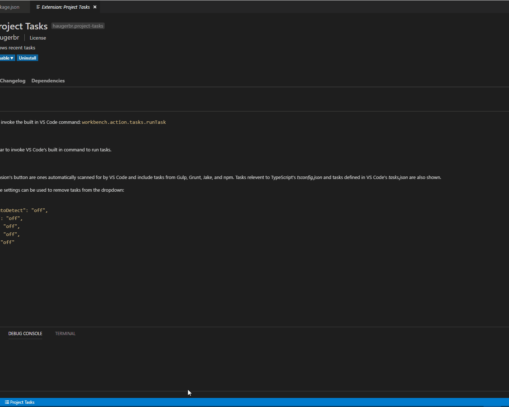

# Project Tasks

A simple status bar button to invoke the built in VS Code command: `workbench.action.tasks.runTask`

## Features

Adds a button to the status bar to invoke VS Code's built in command to run tasks.




## Extension Settings

The tasks shown by this extension's button are ones automatically scanned for by VS Code and include tasks from Gulp, Grunt, Jake, and npm. Tasks relevent to TypeScript's *tsconfig.json* and tasks defined in VS Code's *tasks.json* are also shown.

The following built-in VS Code settings can be used to remove tasks from the dropdown:

```json
{
    "typescript.tsc.autoDetect": "off",
    "grunt.autoDetect": "off",
    "jake.autoDetect": "off",
    "gulp.autoDetect": "off",
    "npm.autoDetect": "off"
}
```

## Known Issues

None

## Release Notes

### 1.0.0

Initial release